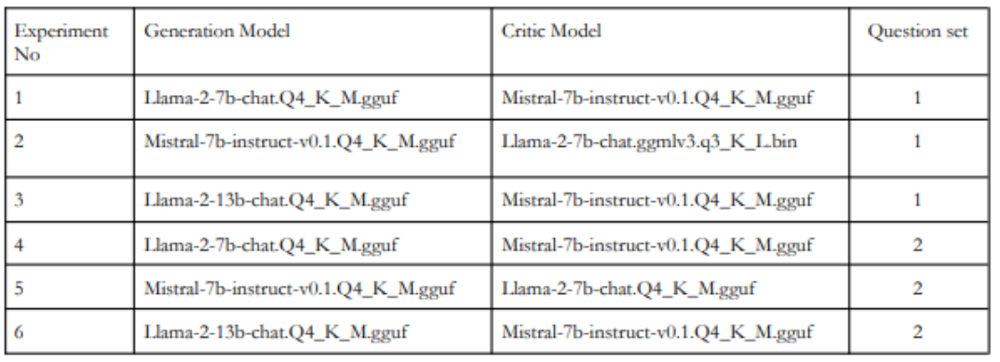
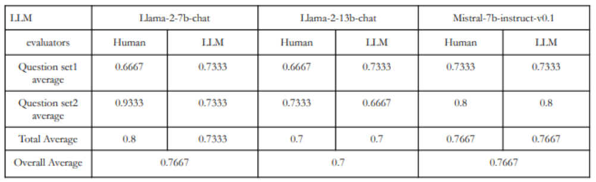

# RAG Research paper QA

This project focuses on developing a RAG chatbot capable of answering questions related to specific research papers provided. The research papers, in PDF format, are chunked and embedded using the sentence transformer [all-MiniLM-L12-v2](https://sbert.net/docs/sentence_transformer/pretrained_models.html). These embeddings are stored in a chroma vector store. During inference, the top-K relevant documents to the user's question are retrieved, and a large language model (LLM) is prompted to generate an answer.

Several 4-bit quantized LLMs were selected to evaluate and compare their performance:
1. Llama2 7b chat
2. Llama2 13b chat
3. Mistral 7b Instruct

## Evaluation 

2 research paper : Attention is all you need paper and DialoGPT paper were used during evaluation, with two sets of questions related to each paper formed.

4 human evaluators and LLMs were employed to evaluate the responses generated.

### Evaluation metrics

### Tuned parameters

### Results

